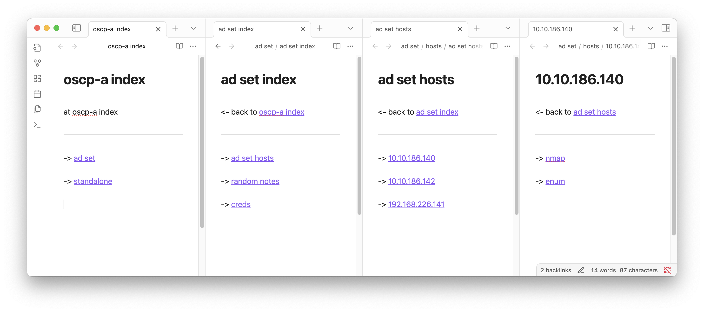

# notesplz


makes browsable notes like that from a yaml config

## install
```
make install
```

## usage
```
notesplz <config_file>
```

### config file
yaml file should follow this structure:

```yaml
Project:
  "oscp-a"
VPN IP:
  192.168.45.166
Box Sets:
  ad set:
    hosts:
      10.10.186.140
      10.10.186.142
      192.168.226.141
    cred page per host or set:
      "set"
    make graph directory: 
      "yes" # deprecated soon
  standalone:
    hosts:
      192.168.226.143
      192.168.226.144
      192.168.226.145
    cred page per host or set:
      "host"
    make graph directory:
      "no"
```
